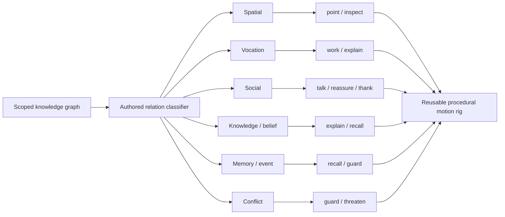

# NPC Relation and Reusable Action Graph

The server-owned cognition catalog classifies every canonical graph predicate.
Each class exposes presentation-only actions; it never executes gameplay intents.

The `/v1/npcs/{persistent_id}/graph` response includes category colors, reusable
actions, renderer-ready nodes and edges, and a scoped Mermaid representation.
